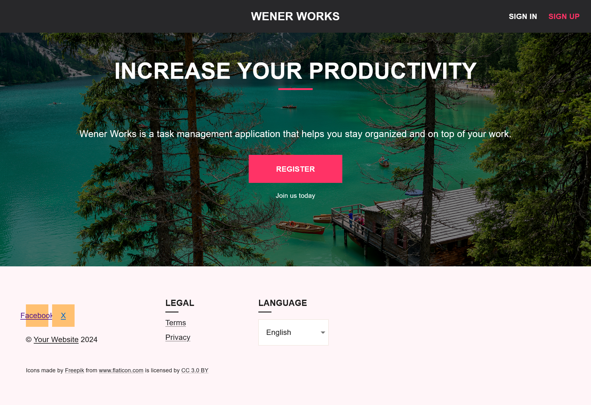

# Kanban-Board
A personal project for learning purposes. It is a Kanban Board that keeps track of tasks for users.

## Table of Contents
- [Screenshots](#screenshots)
    - [Landing Page](#landing-page)
    - [Signin Page](#signin-page)
    - [Signup Page](#signup-page)
    - [Tasks Page](#tasks-page)
    - [Demonstration of salting and hashing in database](#demonstration-of-salting-and-hashing-in-database)
- [Demo](#demo)
- [Installation](#installation)
- [License](#license)

## Screenshots
### Landing Page
![home][home]

### Signin Page
![signin][signin]

### Signup Page
![signup][signup]

### Tasks Page
![tasks][tasks]

### Demonstration of salting and hashing in database
![salthash][salthash]

[home]: public/imgs/home_ex.png
[signin]: public/imgs/signin_ex.png
[signup]: public/imgs/signup_ex.png
[tasks]: public/imgs/tasks_ex.png
[salthash]: public/imgs/salthash_ex.png

## Demo

## Installation

## License
MIT License